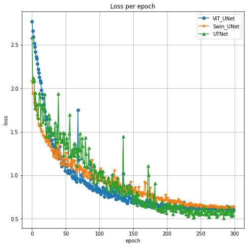
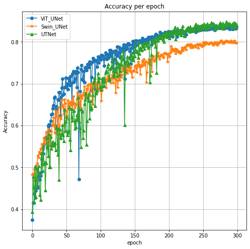
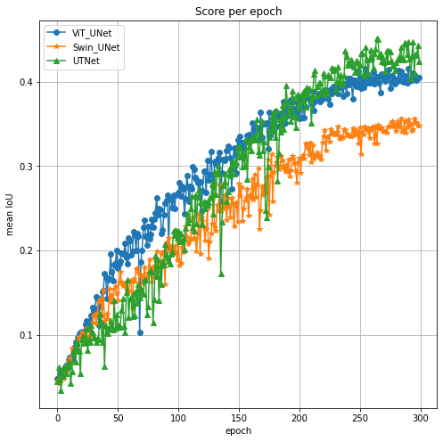

# XAI606-Project2
This repository is for project in XAI606 courses.

Project provider: https://github.com/mjy8086/semantic_segmentation_2D_ViT_UNet

## Dataset

## Training Result

### Loss

### Pixel Accuracy

### mIoU

## Performance
||TransUNet|Swin UNet|UTNet|  
|:-----:|----|-------|-------|
|# of Parameters| 90.08M | 41.35M | **14.42M** | 
|FLOPs(GMac)| 68.48 | **49.49** | 123.12 |
|mIoU| 0.3971 | 0.3406 | **0.4947** |
|Pixel Acc| 0.8537 | 0.8043 | **0.8805** |

## Reference
Drone segmentation dataset: http://dronedataset.icg.tugraz.at

Drone segmentation ipynb: https://github.com/tanishqgautam/Drone-Image-Semantic-Segmentation

TransUNet: https://github.com/Beckschen/TransUNet

UTNet, Swin Unet model: https://github.com/yhygao/UTNet
